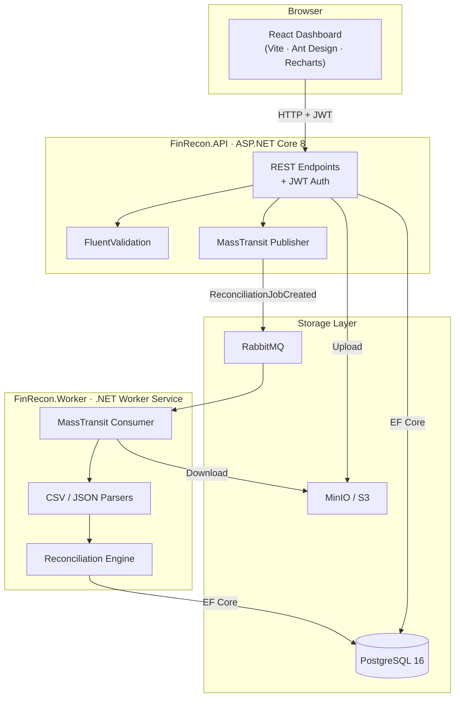
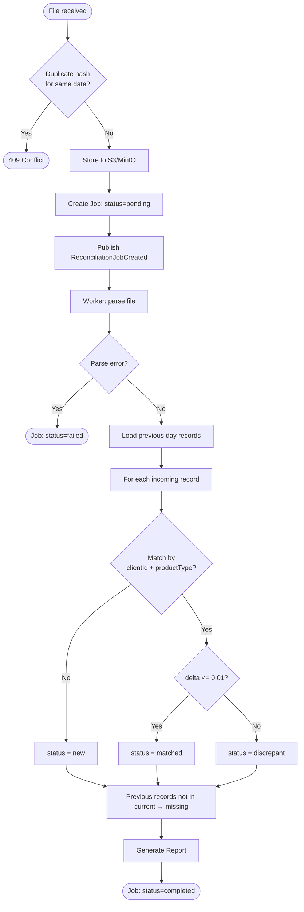
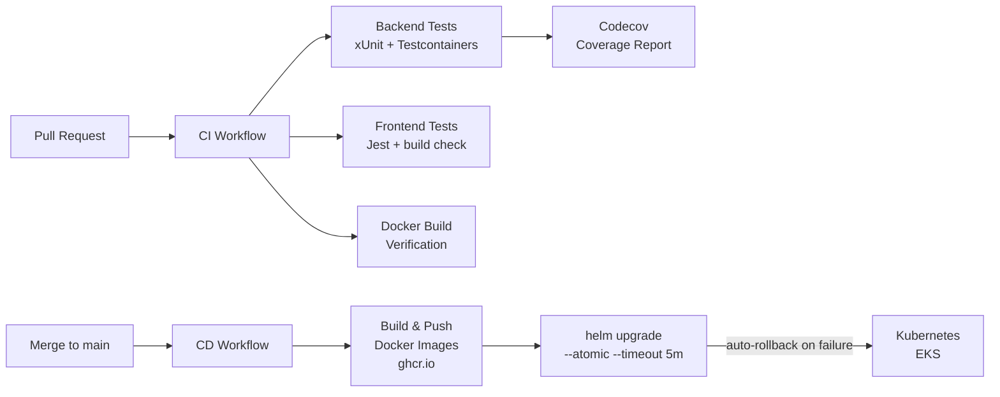
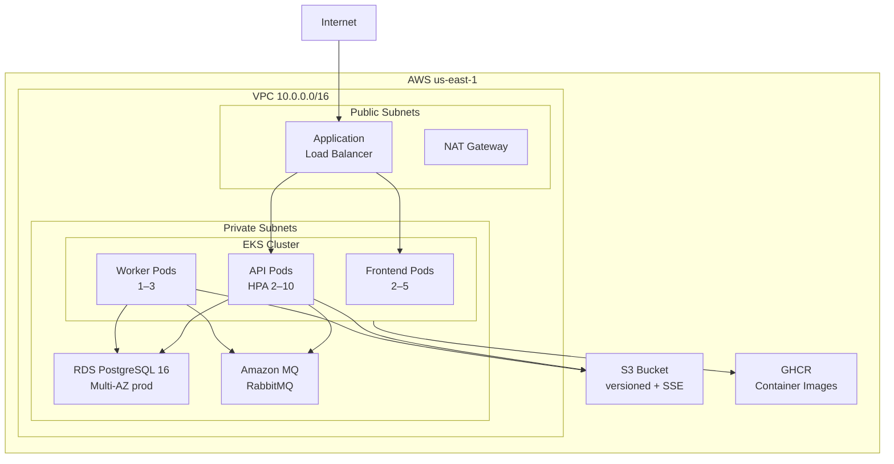
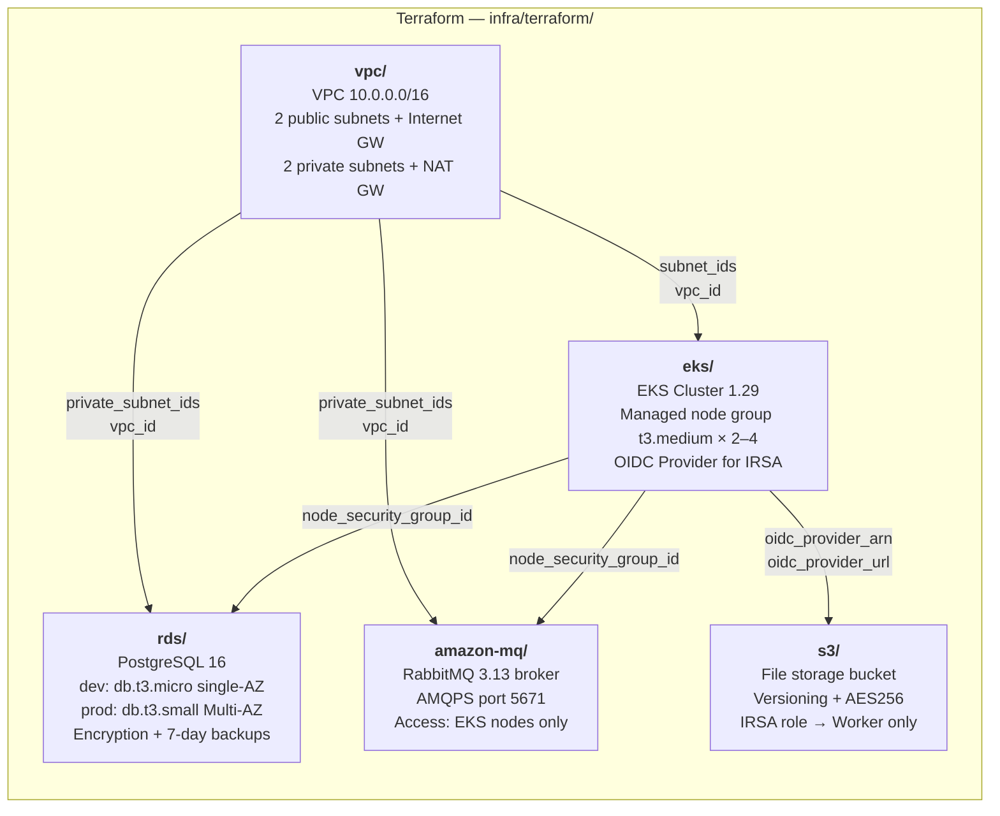
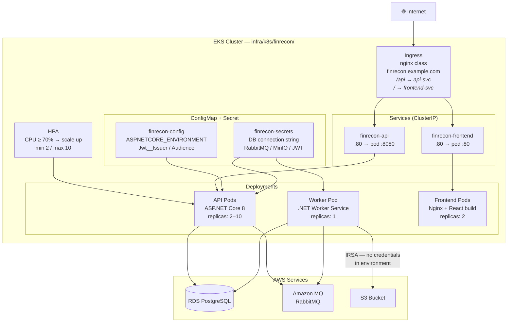

# FinRecon — Financial Reconciliation Dashboard


> A production-grade full-stack application that processes financial product snapshots,
> detects discrepancies through async reconciliation, and surfaces actionable reports via a React dashboard.
> Demonstrates full ownership across cloud infrastructure, backend services, and frontend — targeting real-world fintech scenarios.

---

## Architecture



> **Key async flow:** File upload returns `201 Created` immediately. The API publishes a message to RabbitMQ; the Worker consumes it independently — decoupling upload throughput from processing time.

---

## Reconciliation Algorithm



---

## CI/CD Pipeline



---

## Cloud Infrastructure (Phase 2)



---

## Terraform Modules



> Remote state stored in S3 (`finrecon-terraform-state`). Same `.tf` files for dev and prod — environment differences controlled via `terraform.tfvars`.

---

## Kubernetes / Helm



---

## Tech Stack

| Layer | Technology |
|---|---|
| **Frontend** | React 18, TypeScript, Vite, Ant Design, Recharts, React Query, Axios |
| **Backend API** | .NET 8, ASP.NET Core, FluentValidation, JWT (HS256) |
| **Backend Worker** | .NET 8 Worker Service, MassTransit, CsvHelper |
| **Domain** | Clean Architecture, Result\<T\> pattern, Domain state machine |
| **Database** | PostgreSQL 16 via EF Core 8 + Npgsql |
| **Messaging** | RabbitMQ 3.x + MassTransit (retry policy, dead-letter queue) |
| **Storage** | MinIO (local) / AWS S3 (cloud) |
| **Infrastructure** | Terraform, Kubernetes, Helm, Docker Compose |
| **CI/CD** | GitHub Actions, GHCR, ArgoCD-ready |
| **Testing** | xUnit, FluentAssertions, Testcontainers, Jest |

---

## Key Design Decisions

**1. Clean Architecture with enforced dependency rules.**
`Core` has zero external dependencies — only BCL and logging abstractions. The reconciliation engine is independently testable with zero mocks. Infrastructure implements Core interfaces and is the only layer that knows about Postgres or RabbitMQ.

**2. Async reconciliation via RabbitMQ instead of synchronous processing.**
The API returns `201 Created` immediately; the Worker runs independently. This decouples upload throughput from processing time and allows horizontal Worker scaling without touching the API.

**3. SHA-256 duplicate detection at both application and database level.**
The domain service checks the hash before creating a job. The database enforces a unique index on `(file_hash, reference_date)` as a backstop — defense-in-depth appropriate for financial data.

**4. `decimal` arithmetic with explicit tolerance constant.**
`ReconciliationConstants.MatchTolerance = 0.01m` — using `decimal` throughout prevents floating-point rounding errors unacceptable in financial calculations. The tolerance constant is centrally defined and easily testable.

**5. Testcontainers for integration tests instead of in-memory database.**
SQLite in-memory tests miss Postgres-specific behaviors (enum storage as string, constraint enforcement, unique indexes). Testcontainers starts a real Postgres 16 container, catching real integration failures.

**6. `Result<T>` pattern for business errors.**
Domain methods never throw for expected errors. Callers handle errors explicitly — prevents silent exception swallowing and makes API response mapping explicit and auditable.

---

## Getting Started

### Prerequisites
- Docker Desktop (or Docker Engine + Compose)
- `.NET 8 SDK` (for local dev without Docker)
- `Node 20+` (for frontend local dev)

### Local Development (Docker Compose)

```bash
# 1. Clone and copy env file
git clone https://github.com/guicamarotto/finrecon.git
cd finrecon
cp .env.example .env

# 2. Start everything (postgres, rabbitmq, minio, api, worker, frontend)
docker compose up

# 3. Open the dashboard
open http://localhost:3000

# Default API: http://localhost:5000
# RabbitMQ UI: http://localhost:15672  (finrecon / finrecon_dev_password)
# MinIO console: http://localhost:9001  (minioadmin / minioadmin_dev_password)
# Swagger UI:  http://localhost:5000/swagger
```

**First login:** Register a user at `POST /api/auth/register` or via the login page.

### Running Tests

```bash
# Backend (unit + integration — requires Docker for Testcontainers)
cd src && dotnet test

# Frontend
cd frontend && npm test

# Health check
curl http://localhost:5000/api/health
```

---

## API Reference

| Method | Path | Auth | Description |
|---|---|---|---|
| `POST` | `/api/auth/register` | — | Register a new user |
| `POST` | `/api/auth/login` | — | Login, returns JWT |
| `POST` | `/api/reconciliations` | JWT | Upload file for reconciliation |
| `GET` | `/api/reconciliations` | JWT | List jobs (paginated, filterable) |
| `GET` | `/api/reconciliations/{id}` | JWT | Job detail with report |
| `GET` | `/api/reconciliations/{id}/records` | JWT | Records with filters |
| `GET` | `/api/health` | — | Liveness + readiness |

Full Swagger docs available at `http://localhost:5000/swagger` in development.

---

## File Format Spec

**CSV**
```csv
client_id,product_type,value,date
C001,Equity,1500.00,2025-01-15
C002,Crypto,320.50,2025-01-15
```

**JSON**
```json
{
  "referenceDate": "2025-01-15",
  "records": [
    { "clientId": "C001", "productType": "Equity", "value": 1500.00 },
    { "clientId": "C002", "productType": "Crypto", "value": 320.50 }
  ]
}
```

Valid product types: `Equity`, `Fund`, `Crypto`, `Bond`

---

## Project Structure

```
finrecon/
├── src/
│   ├── FinRecon.Core/          # Domain models, interfaces, engine (zero external deps)
│   ├── FinRecon.Infrastructure/ # EF Core, MinIO adapter, MassTransit setup
│   ├── FinRecon.API/           # ASP.NET Core Web API + JWT auth
│   ├── FinRecon.Worker/        # RabbitMQ consumer + CSV/JSON parsers
│   └── FinRecon.Tests/         # xUnit unit + Testcontainers integration tests
├── frontend/                   # React 18 + Vite SPA
├── infra/
│   ├── terraform/              # AWS VPC, EKS, RDS, S3, Amazon MQ modules
│   └── k8s/finrecon/           # Helm chart with HPA and Ingress
├── .github/workflows/          # CI (build+test), CD (build+push+deploy), Security scan
├── docker-compose.yml          # Full local stack — one command startup
├── .env.example                # Environment variable template
├── PRD.md                      # Product requirements
└── CLAUDE.md                   # Developer conventions and domain rules
```

---

## Cloud Deployment (Phase 2)

```bash
# Deploy AWS infrastructure
cd infra/terraform
cp environments/dev/terraform.tfvars.example terraform.tfvars
# Fill in db_password and rabbitmq_password
terraform init && terraform apply

# Deploy to Kubernetes via Helm
helm upgrade --install finrecon ./infra/k8s/finrecon \
  -f ./infra/k8s/finrecon/values.dev.yaml \
  --set api.image.tag=<sha>
```

---

## Roadmap

- **Phase 2 (Infrastructure):** Terraform + EKS deployment, ArgoCD GitOps, GitHub Actions full CD pipeline
- **Phase 3 (Features):** Real-time job status via SignalR WebSockets, PDF/Excel export, RabbitMQ metrics panel
- **Phase 4 (ML):** Anomaly detection on deltas using ML.NET or Python microservice

---

## License

MIT
